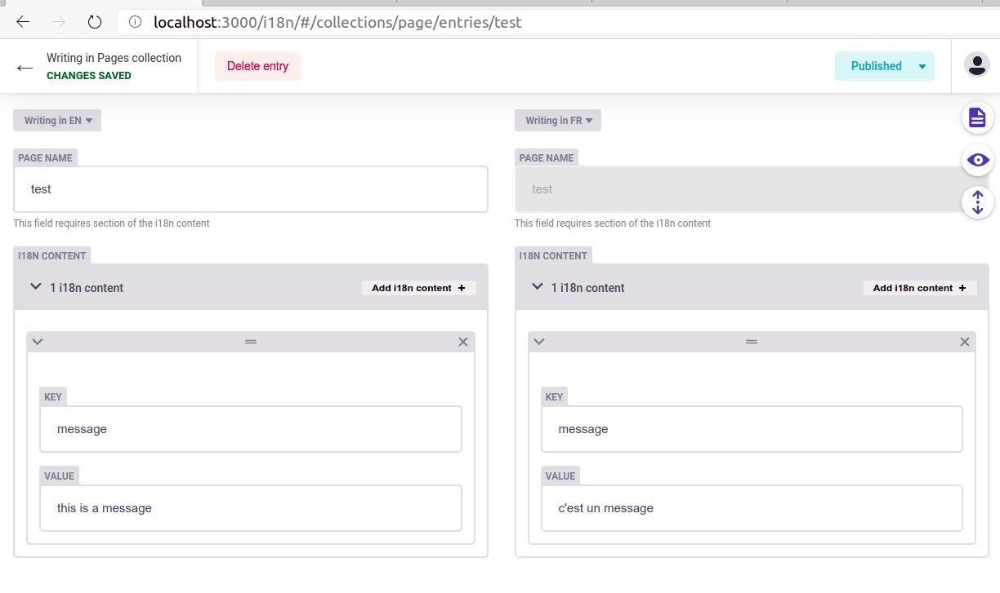

# nuxt-i18n-netlify-cms-example

[](https://hits.seeyoufarm.com)

## Screenshot



## Build Setup

```bash
# install dependencies
$ yarn install

# serve with hot reload at localhost:3000
$ yarn dev

# build for production and launch server
$ yarn build
$ yarn start

# generate static project
$ yarn generate
```

## References

* [Nuxt i18n external JSON setup](https://phrase.com/blog/posts/nuxt-js-tutorial-i18n/#External_JSON_or_JS_Files)
